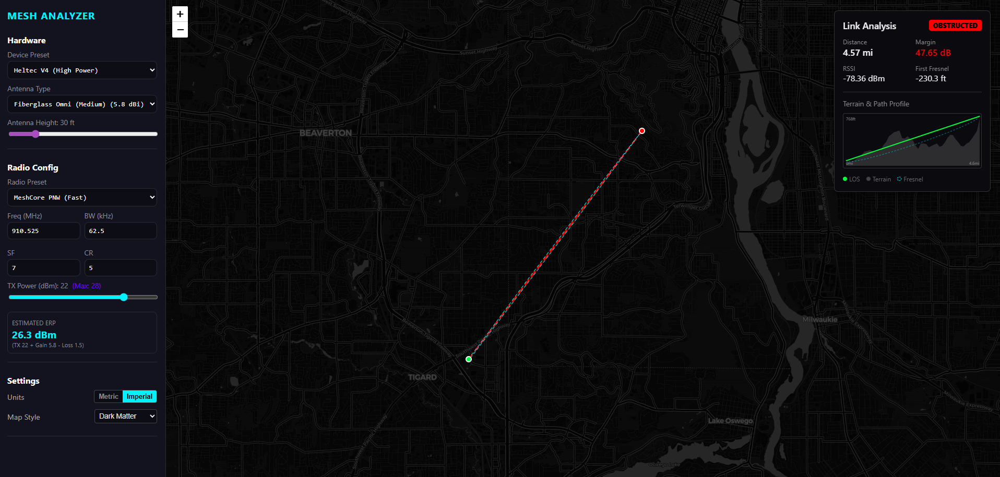

# meshRF 📡

A professional-grade RF propagation and link analysis tool designed for LoRa Mesh networks (Meshtastic, Reticulum, Sidewinder). Built with **React**, **Leaflet**, and a high-fidelity **Geodetic Physics Engine**.



## ✨ Features

### 📡 Advanced Link Analysis

- **Geodetic Physics Engine**: Calculates **Earth Bulge** and effective terrain height based on link distance and configurable **K-Factor**.
- **WISP-Grade Quality**: Evaluates links using the strict **60% Fresnel Zone Clearance** rule (Excellent/Good/Marginal/Obstructed).
- **Multi-Variable Profile**: Visualizes Terrain, Earth Curvature, Line of Sight (LOS), and Fresnel Zones on a dynamic 2D chart.
- **Clutter Awareness**: Simulates signal loss through trees or urban "clutter" layers.
- **Smart Updates**: Analysis only triggers when both TX and RX points are placed, minimizing unnecessary API calls.

### 📍 Smart Location Optimization ⚠️ _In Development_

- **Area Search**: Draw a bounding box on the map to automatically scan for optimal node placement.
- **Heatmap Scoring**: Analyzes terrain and line-of-sight to suggest the best locations based on RF coverage. (Powered by the **RF Engine** background worker).
- _Note: This feature is currently in active development and may have incomplete functionality._

### ⚡ Batch Operations

- **Bulk Link Matrix**: Import a simple CSV of nodes (`Name, Lat, Lon`) and instantly compute link budgets for every possible pair.
- **Automated Reporting**: Export detailed CSV reports containing RSSI, Signal Margin, and Clearance values for hundreds of potential links.

### 🛠️ Hardware Simulation

- **Device Presets**: Pre-loaded specs for popular mesh hardware (Heltec V3, T-Beam, RAK4631, Station G2).
- **Radio Config**: Adjust Spreading Factor (SF), Bandwidth (BW), and Coding Rate (CR) to simulate real-world LoRa modulation (LongFast, ShortFast).
- **Antenna Modeling**: Select standard antennas (Stubby, Dipole, Yagi) or input custom gain figures.

### 🔭 Viewshed Analysis ⚠️ _In Development_

- **WebGL-Powered Visualization**: Real-time viewshed overlay showing visible terrain from observer point.
- **Dynamic Calculation**: Interactive observer placement with instant terrain visibility analysis.
- **Red/Green Overlay**: Visual indication of obstructed (red) vs. visible (green) terrain areas.
- _Note: This feature is currently in active development and may have incomplete functionality._

### 🎨 Modern Experience

- **Responsive UI**: "Glassmorphism" design with a collapsible sidebar and mobile-friendly drawer navigation.
- **Dynamic Maps**: Seamlessly switch between **Dark Matter**, **Light**, **Topography**, and **Satellite** basemaps.
- **Metric/Imperial**: Toggle between Metric (km/m) and Imperial (mi/ft) units on the fly.

---

## 🚀 Getting Started

### Prerequisites

- [Node.js](https://nodejs.org/) (v18+) **OR** [Docker](https://www.docker.com/)

### 🐳 Running with Docker (Recommended)

The system is designed as a set of microservices (Frontend, API, Worker, Redis). The easiest way to run it is with Docker Compose.

1. **Clone and Run**:

   ```bash
   git clone https://github.com/d3mocide/meshrf.git
   cd meshrf
   docker compose up --build
   ```

2. **Access the App**:

   - Frontend: `http://localhost:5173`
   - RF Engine API: `http://localhost:5001/docs` (Swagger UI)

3. **Elevation Data Configuration** (Optional):

   The application uses [OpenTopoData](https://www.opentopodata.org/) for elevation tiles. By default, it uses the public API (1000 requests/day). For unlimited access, you can:

   - Use a custom OpenTopoData instance
   - Self-host OpenTopoData with local SRTM data

   Configure via environment variables in `docker-compose.yml`:

   ```yaml
   rf-engine:
     environment:
       - ELEVATION_API_URL=${ELEVATION_API_URL:-https://api.opentopodata.org}
       - ELEVATION_DATASET=${ELEVATION_DATASET:-srtm30m}
   ```

   Available datasets: `srtm30m`, `srtm90m`, `aster30m`, `ned10m` (US only)

   See the [.env.example](file:///.env.example) file for more configuration options.

### 💻 Running Locally (Development)

1.  Clone the repository:

    ```bash
    git clone https://github.com/d3mocide/meshrf.git
    cd meshrf
    ```

2.  Install dependencies:

    ```bash
    npm install
    ```

3.  Start the dev server:

    ```bash
    npm run dev
    ```

4.  **Backend Setup (Required for Analysis)**:
    The frontend requires the Python backend to perform calculations. You can run the backend via Docker while developing the frontend locally:

    ```bash
    docker compose up rf-engine rf-worker redis
    ```

---

## 📐 Usage Guide

1.  **Placement**: Click on the map to place **TX** (Point A) and **RX** (Point B).
    - _Tip: Click again to move points._
2.  **Configuration**: Open the sidebar to select your specific device hardware and antenna height.
3.  **Environment**: Adjust **Refraction (K)** for atmospheric conditions and **Clutter** (e.g., 10m for trees) to see real-world impact.
4.  **Analysis**:
    - **Green**: Good/Excellent Connection (>60% Fresnel Clearance).
    - **Yellow**: Marginal (LOS exists but Fresnel is infringed).
    - **Red**: Obstructed (Earth or Terrain blocking).
5.  **Batch**: Use the "Import Nodes" button to upload a CSV and generate a full mesh network report.

---

## 🏗️ Architecture

The project follows a modern microservices pattern:

- **Frontend (`src/`)**: React + Leaflet + Vite. Handles UI, map interactions, and visualizes results.
- **RF Engine (`rf-engine/server.py`)**: Python FastAPI service. Performs geodetic calculations and API endpoints.
- **RF Worker (`rf-engine/rf_worker.py`)**: Celery worker consuming tasks from Redis. Handles heavy batch processing and optimization jobs.
- **Redis**: Message broker and caching layer.

### Directory Structure

- `src/components`: UI components (Map, Sidebar, Charts).
- `src/context`: Global RF state and batch processing logic.
- `src/utils`:
  - `rfMath.js`: Frontend utils for quick estimates.
  - `rfService.js`: API client for the **RF Engine**.
- `rf-engine`: Backend Python service (FastAPI + Celery).

## 📄 License

MIT License. Free to use and modify.

## ⚠️ Disclaimer

This tool is a simulation based on mathematical models. Real-world RF propagation is affected by complex factors (interference, buildings, weather) not fully modeled here. Always verify with field testing.
